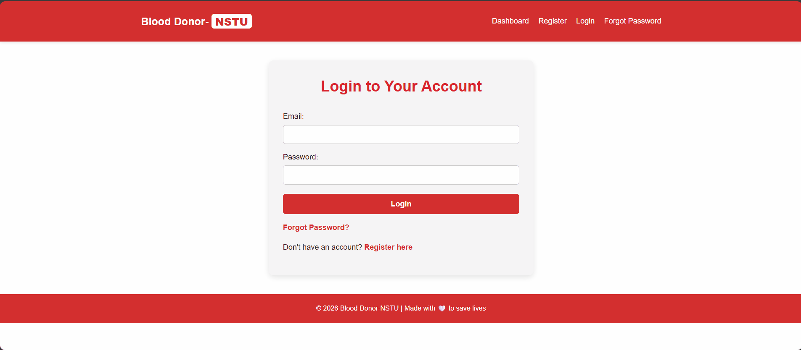

<p align="center">
  
  
  
  <br />
  <h1 align="center">🩸 Blood Donor Connector Platform</h1>
  <p align="center"><em>A modern, full-stack solution connecting blood seekers with eligible donors in real-time.</em></p>
</p>

<br clear="both" />


> [!CAUTION]
> ### 🚀 RECRUITER FAST-PASS
> **⚠️ Technical Note:** The registration system uses a **SendGrid Free Trial** which may have expired. If verification emails are not sending, **new account registration will not work.**
>
> Please use these pre-verified credentials to explore the full dashboard and donor features immediately:
> 
> 👤 **Email:** `sagor2003roy@gmail.com`  
> 🔑 **Password:** `sagorroy1`
> 
> <a href="https://blood-donor-connector-platform-univ.vercel.app">
>   
> </a>

---

## 📺 Product Walkthrough

<div align="center">
  
  <p><em>A quick look at the Donor Dashboard and Real-time Request System.</em></p>
</div>

---

## 📖 About The Project

This platform addresses the critical need for timely blood donations at **Noakhali Science and Technology University**. It utilizes a distributed cloud architecture to ensure high availability and secure data handling, automating the process of finding eligible donors based on location, blood type, and donation history.

### ✨ Key Features

* 🔐 **Secure Authentication:** JWT-based login with Bcrypt password hashing.
* ✅ **Email Verification:** Automated account activation via **SendGrid**.
* 🧠 **Smart Eligibility Logic:** Filters donors based on a strict 3-month donation gap.
* 🔔 **Urgent Notifications:** Instant email alerts to eligible donors near the request location.
* 📅 **Date-Specific Requests:** Seekers can specify exactly when blood is needed.
* 🛡️ **Enterprise-Grade Database:** Powered by **TiDB Cloud** (Distributed SQL) with secure SSL connectivity.

---

## 🛠️ Built With

This project leverages a modern, scalable "PERN-ish" stack hosted entirely on the cloud.

| Layer | Technology | Status |
| :--- | :--- | :--- |
| **Frontend** |    | Deployed on **Vercel** |
| **Backend** |   | Deployed on **Render** |
| **Database** |   | Distributed SQL Cluster |
| **Services** |   | Email & Auth |

---

## 🗂️ Project Structure

<details>
<summary><strong>Click to expand full directory tree</strong></summary>

```bash
Blood-Donor-Connector-Platform-University-Project/
├── Backend/
│   ├── authMiddleware.js
│   ├── server.js
│   ├── package.json
│   └── package-lock.json
│
├── Frontend/
│   ├── image/                  # Static assets (PNG/JPG files)
│   ├── analytics.js
│   ├── dashboard.html
│   ├── dashboard.js
│   ├── index.html
│   ├── index.js
│   ├── login.html
│   ├── login.js
│   ├── register.html
│   ├── register.js
│   ├── forgot-password.html
│   ├── reset-password.html
│   ├── verify-email.html
│   ├── check-email.html
│   ├── style.css
│   ├── toast.js
│   ├── favicon-32x32.png
│   └── vercel.json
│
├── .gitignore
├── LICENSE
└── README.md
```
</details>

# ER Diagram 
[](https://mermaid.live/edit#pako:eNqdVF1v2jAU_SuWn1YJGBRGSt5QyzQ0raoqNG0VUmTim8QisTPb6coo_712PvgILlLnN997z_E9x77e4lBQwD4GecdILEm25MisQoFU6PW12xVbtEqFoBL-FKC0Qj5a4oysQaFPRCEJIcsZcP25LgB5tcQOEio40UzwNoGJi3cgNSMXmkUsPEKbQ4E9g2pQZYN6k8MeWvHYWgoR463SvRZnb1GRRixNgaLV5iLs3f60ZHFsGrDoY13bamPX_H5RBgNG0cP3Q_zn9PH22_QRcZLBeRQywtLzcE6U-iskDRKikkP6brqYIUo0BCIKVkzq5BwaA6cgz-Oh4JqEOsgTweG07dKLwNptm__qaD5kenOILub3vy2OqeAZpLEK6DmkylQmBlqsgZ_qWMx_zIzhCnSVDeAlZ2ZfVe0an49ewvZS1y7Lbc5Ft7_2FmMdb9NVqXoqKofMk3gQjBsKLaqn0KvvvnlfF9yb_bJ8RAmXI-XtNpPnsFVpoou2SYfn3lLUJFySyjn9iJyWRS3YibPHsIO0phmrsaXAOXktMcdJ9x19uLf_8sF5FbiDY8ko9rUsoIMzkGayzRaXIswPkoCZf1x-YESuLZ_F5IQ_CZE1MCmKOMF-RFJldkVunaq_8X1JOd-3ouAa-6PBpOTA_ha_YL_b7_Xtmown_cHgZuSNvOF4PB518Ab7Xs-7uf4ynPQnw4HX967H0PV2HfyvPJ4Xabp7AyNQ8-w)

## 📸 Screenshots

<div align="center">
  <table>
    <tr>
      <td align="center"><strong>User Overview</strong></td>
      <td align="center"><strong>New Request Form</strong></td>
    </tr>
    <tr>
      <td></td>
      <td></td>
    </tr>
    <tr>
      <td align="center"><strong>Active Statistics</strong></td>
      <td align="center"><strong>Request Management</strong></td>
    </tr>
    <tr>
      <td></td>
      <td></td>
    </tr>
  </table>
  <p><em>Real-time dashboard views and the updated blood request interface.</em></p>
</div>

---

## 🚀 Getting Started

To get a local copy up and running, follow these simple steps.

### Prerequisites

* Node.js (v18.x or higher)
* A TiDB Cloud Account (or local MySQL)
* A SendGrid API Key

### Installation

1. **Clone the repo**
    ```sh
    git clone [https://github.com/sagorroy2003/Blood-Donor-Connector-Platform-University-Project.git](https://github.com/sagorroy2003/Blood-Donor-Connector-Platform-University-Project.git)
    ```
2. **Install Backend Packages**
    ```sh
    cd Backend
    npm install
    ```
3. **Configure Environment**
    Create a `.env` file in the `Backend/` root and add your secrets:
    ```env
    DB_HOST=gateway01.ap-southeast-1.prod.aws.tidbcloud.com
    DB_USER=your_tidb_user
    DB_PASSWORD=your_tidb_password
    DB_NAME=blood_connector_db
    DB_PORT=4000
    JWT_SECRET=your_super_secret_key
    SENDGRID_API_KEY=SG.your_sendgrid_key
    SENDGRID_FROM_EMAIL=your_verified_sender_email
    CA=./certs/isrgrootx1.pem
    VERCEL_FRONTEND_URL=[https://blood-donor-connector-platform-univ.vercel.app](https://blood-donor-connector-platform-univ.vercel.app)
    ```
4. **Run the Server**
    ```sh
    npm start
    ```

---

## 👤 Contact

<div align="center">
  
  <br /> 
  <p align="center"> Built with ❤️ to serve the community at <strong>Noakhali Science and Technology University</strong> </p>
  
  <hr width="50%" />

  <p>
    <strong>Sagor Roy</strong> &nbsp;&nbsp; | &nbsp;&nbsp; 
    <a href="https://www.linkedin.com/in/sagorroy2003" target="_blank">
      
    </a>
  </p>

  <p>
    <a href="mailto:sagor2003roy@gmail.com">
      
    </a>
    &nbsp;
    <a href="https://www.facebook.com/sagor.roy.956245">
      
    </a>
  </p>

  <p>
    <strong>Project Link:</strong> <br />
    <a href="https://github.com/sagorroy2003/Blood-Donor-Connector-Platform-University-Project">Blood-Donor-Connector-Platform-University-Project</a>
  </p>
</div>
